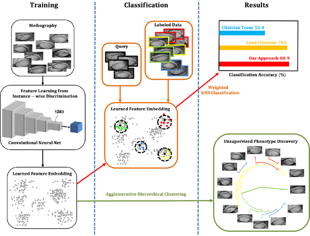

# meibo-ML: Meibography phenotyping and classification from unsupervised discriminative feature learning

by Chun-Hsiao Yeh, Stella X. Yu and Meng C. Lin at School of Optometry and ICSI, UC Berkeley

<em>Translational Vision Science & Technology February 2021, Vol.10, 4.<em>

[Journal Page](https://tvst.arvojournals.org/article.aspx?articleid=2772251) | [PDF](http://www1.icsi.berkeley.edu/~stellayu/publication/doc/2021meiboTVST.pdf) | 



The proposed NPID approach automatically analyses MG atrophy severity from meibography images without prior image annotations, and categorizes the gland characteristics through hierarchical clustering. This method provides quantitative information on the MG atrophy severity based on the analysis of phenotypes. Further information please contact [Chun-Hsiao Yeh](mailto:daniel-yeh@berkeley.edu)


## Updates
[3/2021] Initial Commit. We re-implemented meibo-ML in this repo. (instruction below).


## Requirements
### Packages
* Python >= 3.7, < 3.9
* PyTorch >= 1.6
* tensorboard >= 1.14 (for visualization)
* pandas
* numpy

## Citation
If you find our work inspiring or use our codebase in your research, please cite our work.
```
@article{yeh2021meibography,
  title={Meibography phenotyping and classification from unsupervised discriminative feature learning},
  author={Yeh, Chun-Hsiao and Stella, X Yu and Lin, Meng C},
  journal={Translational Vision Science \& Technology},
  volume={10},
  number={2},
  pages={4--4},
  year={2021},
  publisher={The Association for Research in Vision and Ophthalmology}
}
```

### License
This project is licensed under the MIT License. See [LICENSE](https://github.com/danielchyeh/meibo-ML/blob/main/LICENSE) for more details. The parts described below follow their original license.

## Acknowledgements
This is a project based on this [pytorch template](https://github.com/victoresque/pytorch-template). The pytorch template is inspired by the project [Tensorflow-Project-Template](https://github.com/MrGemy95/Tensorflow-Project-Template) by [Mahmoud Gemy](https://github.com/MrGemy95)


